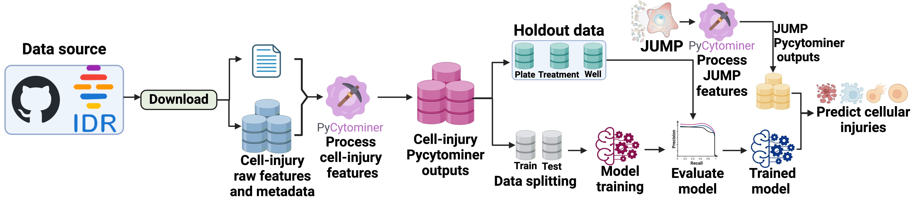

# Predicting cellular injury using Pyctominer

[](https://zenodo.org/doi/10.5281/zenodo.12514972)


> Diagram protraying taken to conduct this study.

The objective of this project was to utilize [Pycytominer](https://github.com/cytomining/pycytominer) for generating feature-selected profiles from image-based data, aiming to train a multi-class logistic regression model for predicting cellular injury.

We obtained the cell-injury dataset from [IDR](https://idr.openmicroscopy.org/webclient/?show=screen-3151) and its corresponding [GitHub repository](https://github.com/IDR/idr0133-dahlin-cellpainting).
Using [Pycytominer](https://github.com/cytomining/pycytominer), we processed these datasets to prepare them for subsequent model training.
We trained our model on the cell-injury dataset to predict 15 different types of injuries and our trained model to the JUMP dataset to predict cellular injuries.

## Data sources

We obtained the cell-injury dataset from [IDR](https://idr.openmicroscopy.org/webclient/?show=screen-3151) and its corresponding [GitHub repository](https://github.com/IDR/idr0133-dahlin-cellpainting).
Using Pycytominer, we processed these datasets to prepare them for subsequent model training.
We trained our model on the cell-injury dataset to predict 15 different types of injuries and our trained model to the JUMP dataset to predict cellular injuries.
| Data Source | Description |
|-------------|-------------|
| [IDR repository](https://github.com/IDR/idr0133-dahlin-cellpainting/tree/main/screenA) | Repository containing annotated screen data |
| [Supplemental metadata](https://static-content.springer.com/esm/art%3A10.1038%2Fs41467-023-36829-x/MediaObjects/41467_2023_36829_MOESM5_ESM.xlsx) | Supplementary metadata dataset |
| [JUMP](https://jump-cellpainting.broadinstitute.org/) | JUMP data repository|

## Repository structure

Overall structure of our repo.

| Directory | Description |
|-----------|-------------|
| [Data](./data) | Contains all the datasets |
| [Results](./results) | Stores all results generated from the notebook modules in the `./notebooks` directory |
| [Src](./src) | Contains utility functions |
| [Notebooks](./notebooks/) | Contains all notebook modules for our analysis |

## Notebook structure

Below are all the notebook modules used in our study.

| Notebook | Description |
|----------|-------------|
| [0.feature_selection](./notebooks/0.feature_selection/) | Labels wells with cellular injuries, identifies shared features between the cell injury dataset and JUMP, and selects features for the cell injury dataset |
| [1.data_splits](./notebooks/1.data_splits/) | Generates training and testing splits, including holdout sets (plate, treatment, and random wells) |
| [2.modeling](./notebooks/2.modeling/) | Trains and evaluates a multi-class logistic regression model |
| [3.jump_analysis](./notebooks/3.jump_analysis/) | Applies our model to the JUMP dataset to predict cellular injuries |
| [4.visualizations](./notebooks/4.visualizations/) | Contains a notebook responsible for generating our figures |

## Installing respoitory and dependencies

This installation guide assumes that you have Conda installed.
If you do not have Conda installed, please follow the documentation [here](https://conda.io/projects/conda/en/latest/user-guide/install/index.html).

1. **Clone the repository**: Clone the repository into your local machine and change the directory to the repo.

    ```bash
    git clone git@github.com:WayScience/Cytotoxic-Nuisance-Metadata-Analysis.git && cd Cytotoxic-Nuisance-Metadata-Analysis
    ```

2. **Install dependencies**: There are two environment files in this repository.
One is in the root project folder, containing all the necessary packages to conduct our analysis in Python.
The other is within the `./notebooks/4.visualization` directory, which includes packages for generating plots with R.

    - **Analysis environment**: Create and activate the environment for analysis.

        ```bash
        conda env create -f cell_injury.yaml
        conda activate cell-injury
        ```

    - **R visualization environment**: Create and activate the environment for R visualization.

        ```bash
        conda env create -f ./notebooks/4.visualization/visualization_env.yaml
        conda activate visualization-env
        ```

That's it! Your Conda environments should now be set up with the specified packages from the YAML files.

## Analysis summary

### Feature selection

Before conducting any feature selection processes, we first labeled wells associated with an injury.
We achieved this using the datasets downloaded from the [cell-injury](https://www.nature.com/articles/s41467-023-36829-x) study, which provided information on which treatments were associated with which injuries.
After mapping injury labels onto the wells based on their treatments, we applied feature alignment.

We identified which features in the `cell-injury` dataset were present in the JUMP dataset.
Once identified, we used only the "shared" features—morphological features common to both the JUMP and cell-injury datasets.

Next, we applied feature selection using [Pycytominer](https://github.com/cytomining/pycytominer) to obtain informative features.
This process generated our `feature-selected` profiles, which will be used to train our multi-class logistic regression model.

### Data splitting

We split our data into training, testing, and holdout sets.
First, we generated our holdout splits, which are reserved exclusively for evaluating the model's performance and are not used during the model's training or tuning.

1. **Plate Holdout Set**: We randomly selected 10 plates.
2. **Treatment Holdout Set**: We selected one treatment per injury to hold out.
However, given that some cellular injuries have very low diversity in treatments, we created a heuristic that only holds out treatments if the cell injuries have more than 10 different treatments.
For cell injuries that didn't meet this criterion, no treatments were held out.
3. **Well Holdout Set**: We randomly selected wells in each plate.
Due to a significant imbalance between control wells and treated wells, we selected a fixed number of 5 control wells and 10 randomly selected treated wells.

All holdout datasets were removed from the main dataset.
The remaining data was then split into training and testing sets using an 80/20 train/test split, respectively.
We used the `stratify` parameter to preserve the distribution of labels, preventing label imbalances that could lead to classification problems.

### Training the model

We trained a multi-class logistic regression model using randomized cross-validation for hyperparameter tuning to fine-tune our model.
Our logistic regression model was set to `multi_class="multinomial"`, indicating that it applies a softmax approach to handle and classify multiple classes.
The model also included `class_weight="balanced"` to ensure the model pays more attention to minority classes during training, preventing label imbalance or bias.

### Applying model to JUMP data

We applied our trained multi-class logistic regression model to the JUMP dataset to predict injuries present in each well.
We loaded the JUMP dataset and selected only the features that were shared with the `cell-injury` dataset.
Using the model, we generated predictions for each well and then analyzed these predictions to understand the distribution and types of injuries.

## Citing our work

Please consider using our paper to cite our work or the usage of Pycytominer.
> Erik Serrano, Srinivas Niranj Chandrasekaran, Dave Bunten, Kenneth I. Brewer, Jenna Tomkinson, Roshan Kern, Michael Bornholdt, Stephen Fleming, Ruifan Pei, John Arevalo, Hillary Tsang, Vincent Rubinetti, Callum Tromans-Coia, Tim Becker, Erin Weisbart, Charlotte Bunne, Alexandr A. Kalinin, Rebecca Senft, Stephen J. Taylor, Nasim Jamali, Adeniyi Adeboye, Hamdah Shafqat Abbasi, Allen Goodman, Juan C. Caicedo, Anne E. Carpenter, Beth A. Cimini, Shantanu Singh, Gregory P. Way <https://arxiv.org/abs/2311.13417>
